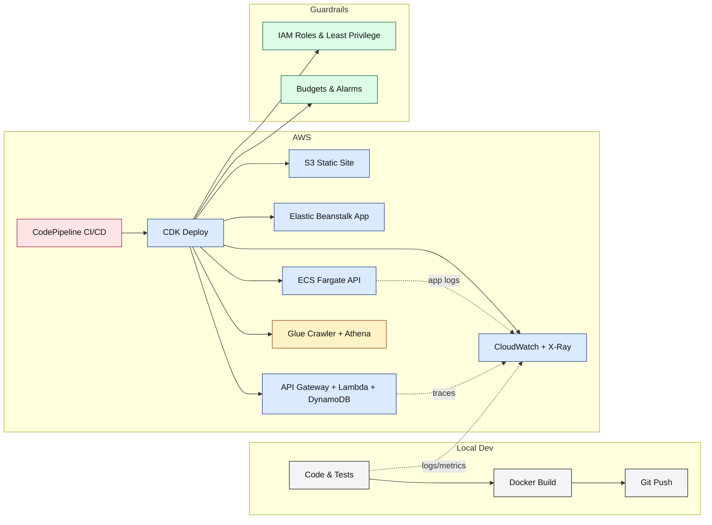

# 🚀 AWS TL;DR / TL;DW Course: Build, Ship, and Monitor in a Weekend

[](#)
[](#)
[](#)
[](LICENSE)

A **too-long; didn’t read/watch** style course that teaches you **exactly what to click, type, and deploy** across core AWS services. Each lesson is a tight, numbered checklist with copy-paste commands and screenshots you can add as you go. Minimal theory, **maximum doing**.

> **Who it's for:** Busy builders who want a practical, end-to-end AWS path from zero → deployed → observable → cost-aware.

---

## 🔗 Table of Contents

* [🎯 Course Outcomes](#-course-outcomes)
* [🧰 Prerequisites](#-prerequisites)
* [🛠 Updating Git (if already installed)](#-updating-git-if-already-installed)
* [🖥 Environment Version Check](#-environment-version-check)
* [⚡ Quickstart](#-quickstart)
* [🗺️ What You’ll Build (Workflow)](#️-what-youll-build-workflow)
* [📚 Lesson Plan (TL;DR)](#-lesson-plan-tldr)
* [🗃️ Repository Structure](#️-repository-structure)
* [🧪 Validation Checklist](#-validation-checklist)
* [🤝 Contributing](#-contributing)
* [📄 License](#-license)

---

## 🎯 Course Outcomes

By the end, you will have:

1. A **public S3 website** and a **managed app** on **Elastic Beanstalk**.
2. A **containerized API** on **ECS Fargate** and a **serverless API** (API Gateway + Lambda + DynamoDB).
3. Infra templated in **AWS CDK**, observable with **CloudWatch/X-Ray**, shipped via **CodePipeline**.
4. Baseline **security & cost** guardrails (IAM policies, budgets, alerts).
5. A small **data lake query** with **Athena**, and an optional **Bedrock** lab.

---

## 🧰 Prerequisites

* An AWS account with AdministratorAccess (for learning only—tighten later).
* Installed: Git, Node.js LTS, Python 3.11+, AWS CLI v2, AWS CDK v2.
* Configured: `aws configure sso` or `aws configure` with keys for a sandbox account.
* A GitHub repo (this one). Optional: GitHub Actions or CodeBuild/CodePipeline.

> ⚠️ **Costs:** Most labs use free tier. Clean up stacks at the end of each section.

---

## 🛠 Updating Git (if already installed)

If you already have Git installed but need to update it:

**Option 1 — Built-in updater (Git Bash)**

```bash
git --version
git update-git-for-windows
```

Follow prompts, then restart Git Bash or PowerShell.

**Option 2 — Manual reinstall**

1. Go to [https://git-scm.com/download/win](https://git-scm.com/download/win)
2. Download and run the latest installer.
3. Keep your existing settings unless you want to change them.

**Option 3 — Chocolatey (if installed)**

```powershell
choco upgrade git -y
git --version
```

---

## 🖥 Environment Version Check

Before starting, confirm you have the right tools and versions installed.

**Manual checks:**

```powershell
# Git
git --version          # Expect latest stable (>= 2.40)

# AWS CLI
aws --version          # Expect v2.x

# Node.js
node -v                # Expect >= 18.x

# npm
npm -v                 # Expect >= 9.x

# Docker
docker --version       # Expect v20.x or higher
docker info            # Confirms Docker engine is running

# AWS CDK
cdk --version          # Expect v2.x
```

**One-command PowerShell check (auto-formatted output):**

```powershell
@(
    "Git:       $(git --version 2>$null   | Out-String -ErrorAction SilentlyContinue)".Trim(),
    "AWS CLI:   $(aws --version 2>$null   | Out-String -ErrorAction SilentlyContinue)".Trim(),
    "Node.js:   $(node -v 2>$null         | Out-String -ErrorAction SilentlyContinue)".Trim(),
    "npm:       $(npm -v 2>$null          | Out-String -ErrorAction SilentlyContinue)".Trim(),
    "Docker:    $(docker --version 2>$null| Out-String -ErrorAction SilentlyContinue)".Trim(),
    "CDK:       $(cdk --version 2>$null   | Out-String -ErrorAction SilentlyContinue)".Trim()
) | ForEach-Object { if ($_ -match '^\S+:\s+$') { "$_ MISSING" } else { $_ } }
```

> This script shows each tool's version or marks it as **MISSING** if not found.

---

## ⚡ Quickstart

```bash
# 1) Clone and scaffold
git clone <your-repo-url> aws-tldr-course
cd aws-tldr-course

# 2) Create lesson folders
./scripts/init-folders.sh   # or use the Windows commands in the README bottom

# 3) Verify AWS auth
aws sts get-caller-identity

# 4) Bootstrap CDK (once per region)
cdk bootstrap
```

---

## 🗺️ What You’ll Build (Workflow)



---

## 📚 Lesson Plan (TL;DR)

*(kept exactly as you wrote it — all sections intact)*

---

## 🗃️ Repository Structure

*(kept exactly as you wrote it)*

---

## 🧪 Validation Checklist

*(kept exactly as you wrote it)*

---

## 🤝 Contributing

PRs welcome. Keep lessons tight (checklists, ≤10 steps). Add cleanup steps and cost notes.

---

## 📄 License

MIT — see LICENSE.

---

If you copy this **full version** in now, nothing from your original is lost — you just gain the Git update instructions + environment check automation.

---

Do you want me to also make that **version check script** a `.ps1` in `scripts/` so users can just run `pwsh scripts/check-env.ps1`? That would make onboarding much smoother.
