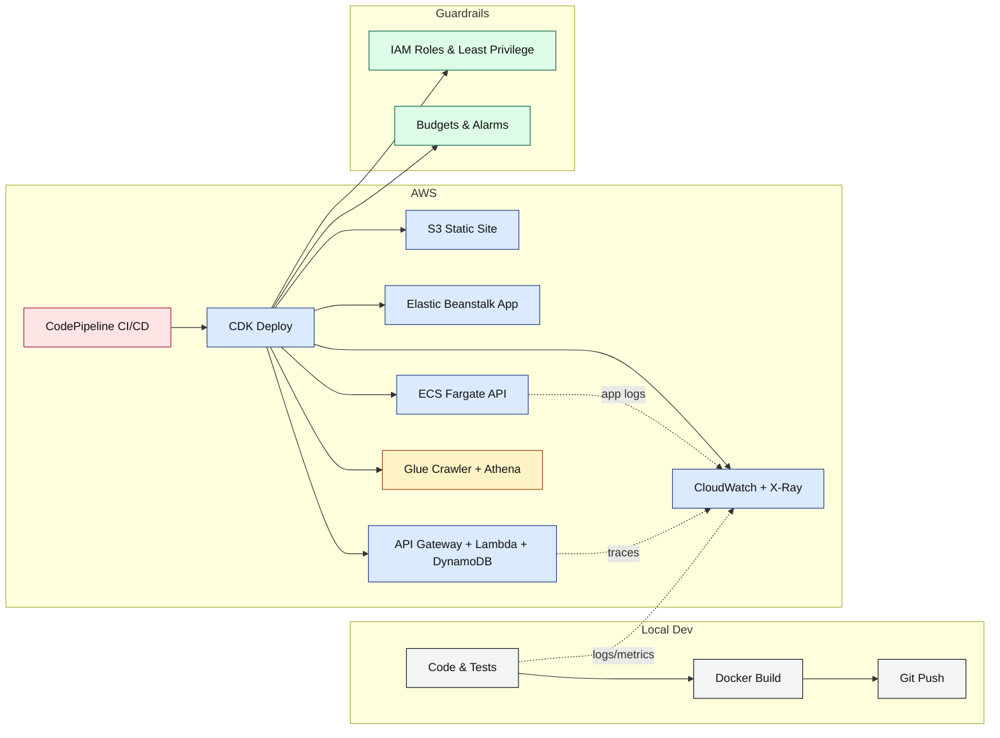

# 🚀 AWS TL;DR / TL;DW Course: Build, Ship, and Monitor in a Weekend

[](#)
[](#)
[](#)
[](LICENSE)

A **too‑long; didn’t read/watch** style course that teaches you **exactly what to click, type, and deploy** across core AWS services. Each lesson is a tight, numbered checklist with copy‑paste commands and screenshots you can add as you go. Minimal theory, **maximum doing**.

> **Who it's for:** Busy builders who want a practical, end‑to‑end AWS path from zero → deployed → observable → cost‑aware.

---

## 🔗 Table of Contents

* [🎯 Course Outcomes](#-course-outcomes)
* [🧰 Prerequisites](#-prerequisites)
* [⚡ Quickstart](#-quickstart)
* [🗺️ What You’ll Build (Workflow)](#️-what-youll-build-workflow)
* [📚 Lesson Plan (TL;DR)](#-lesson-plan-tldr)

  * [Section 0 — Local Setup](#section-0--local-setup)
  * [Section 1 — Accounts & IAM](#section-1--accounts--iam)
  * [Section 2 — CLI & SDK Smoke Tests](#section-2--cli--sdk-smoke-tests)
  * [Section 3 — S3 Static Site](#section-3--s3-static-site)
  * [Section 4 — Compute: EC2 → Elastic Beanstalk](#section-4--compute-ec2--elastic-beanstalk)
  * [Section 5 — Containers on ECS Fargate](#section-5--containers-on-ecs-fargate)
  * [Section 6 — Serverless: API Gateway + Lambda + DynamoDB](#section-6--serverless-api-gateway--lambda--dynamodb)
  * [Section 7 — Infrastructure as Code (CDK)](#section-7--infrastructure-as-code-cdk)
  * [Section 8 — Observability: CloudWatch + X-Ray](#section-8--observability-cloudwatch--x-ray)
  * [Section 9 — CI/CD with CodePipeline](#section-9--cicd-with-codepipeline)
  * [Section 10 — Security & Cost Guardrails](#section-10--security--cost-guardrails)
  * [Section 11 — Data: S3 + Glue + Athena](#section-11--data-s3--glue--athena)
  * [Section 12 — Generative AI with Bedrock (Optional)](#section-12--generative-ai-with-bedrock-optional)
* [🗃️ Repository Structure](#️-repository-structure)
* [🧪 Validation Checklist](#-validation-checklist)
* [🤝 Contributing](#-contributing)
* [📄 License](#-license)

---

## 🎯 Course Outcomes

By the end, you will have:

1. A **public S3 website** and a **managed app** on **Elastic Beanstalk**.
2. A **containerized API** on **ECS Fargate** and a **serverless API** (API Gateway + Lambda + DynamoDB).
3. Infra templated in **AWS CDK**, observable with **CloudWatch/X‑Ray**, shipped via **CodePipeline**.
4. Baseline **security & cost** guardrails (IAM policies, budgets, alerts).
5. A small **data lake query** with **Athena**, and an optional **Bedrock** lab.

---

## 🧰 Prerequisites

* An AWS account with AdministratorAccess (for learning only—tighten later).
* Installed: Git, Node.js LTS, Python 3.11+, AWS CLI v2, AWS CDK v2.
* Configured: `aws configure sso` or `aws configure` with keys for a sandbox account.
* A GitHub repo (this one). Optional: GitHub Actions or CodeBuild/CodePipeline.

> ⚠️ **Costs:** Most labs use free tier. Clean up stacks at the end of each section.

---

## ⚡ Quickstart

```bash
# 1) Clone and scaffold
git clone <your-repo-url> aws-tldr-course
cd aws-tldr-course

# 2) Create lesson folders
./scripts/init-folders.sh   # or use the Windows commands in the README bottom

# 3) Verify AWS auth
aws sts get-caller-identity

# 4) Bootstrap CDK (once per region)
cdk bootstrap
```

---

## 🗺️ What You’ll Build (Workflow)



---
Here’s a **clear, copy-and-share-ready “Getting Started” section** you can drop straight into your repo’s README (or send to clients) so they know exactly how to set this up locally.

---

## 🛠 Getting Started — Local & Client Setup

### **1️⃣ Prerequisites**

Before you or your clients start, make sure the following are in place:

| Requirement        | Details                                                                             | Install Link                                                                              |
| ------------------ | ----------------------------------------------------------------------------------- | ----------------------------------------------------------------------------------------- |
| **AWS Account**    | **AdministratorAccess** permissions (learning only — tighten later for production). | [AWS Signup](https://aws.amazon.com/)                                                     |
| **Git**            | Latest stable release.                                                              | [Download Git](https://git-scm.com/downloads)                                             |
| **Node.js LTS**    | Recommended for AWS CDK and any Node examples.                                      | [Download Node.js LTS](https://nodejs.org/en/)                                            |
| **Python 3.11+**   | For Python SDK (Boto3) examples.                                                    | [Download Python](https://www.python.org/downloads/)                                      |
| **AWS CLI v2**     | Command-line access to AWS.                                                         | [Install AWS CLI v2](https://docs.aws.amazon.com/cli/latest/userguide/install-cliv2.html) |
| **AWS CDK v2**     | Infrastructure as Code.                                                             | [Install AWS CDK](https://docs.aws.amazon.com/cdk/v2/guide/work-with.html)                |
| **GitHub Account** | To pull/push code.                                                                  | [Sign Up GitHub](https://github.com/)                                                     |

---

### **2️⃣ Configure AWS Authentication**

Choose **one** method:

#### **Option A — AWS SSO (Recommended)**

```powershell
aws configure sso
```

Follow prompts to sign in to your AWS SSO portal, pick your account, and choose a role.

#### **Option B — Access Keys**

```powershell
aws configure
```

Enter:

* Access Key ID
* Secret Access Key
* Default region (e.g., `us-east-1`)
* Output format (`json`)

✅ **Test Your Auth**

```powershell
aws sts get-caller-identity
```

You should see your **Account ID**, **User ARN**, and **AWS Account**.

---

### **3️⃣ Clone the Repo**

```powershell
cd C:\Users\<YourUsername>\
git clone https://github.com/emcdo411/aws-tldr-course.git
cd aws-tldr-course
```

---

### **4️⃣ Install Dependencies**

**CDK (Node.js global package):**

```powershell
npm install -g aws-cdk
```

**Optional Python environment:**

```powershell
python -m venv .venv
.venv\Scripts\activate
pip install boto3
```

---

### **5️⃣ Initialize the Folder Structure**

Run the included script to create all folders/subfolders with `.gitkeep` files:

```powershell
pwsh scripts\init-folders.sh
```

*(If running on Windows without bash, just create manually or use the provided PowerShell scaffold script.)*

---

### **6️⃣ Verify GitHub Remote**

```powershell
git remote -v
```

It should show:

```
origin  https://github.com/emcdo411/aws-tldr-course.git (fetch)
origin  https://github.com/emcdo411/aws-tldr-course.git (push)
```

---

### **7️⃣ Costs & Cleanup**

⚠️ **Most labs use the AWS Free Tier**, but:

* **Always delete** stacks, instances, and buckets after each section.
* Run:

```powershell
pwsh scripts\cleanup-all.sh
```

*(Edit the script with the correct cleanup commands per section.)*

---
## 📚 Lesson Plan (TL;DR)

### Section 0 — Local Setup

* Install Git, Node, Python, AWS CLI v2, CDK v2.
* `aws configure sso` (preferred) or `aws configure` (keys).
* Verify with `aws sts get-caller-identity`.
* **Deliverable:** `local-setup/VERIFICATION.md` (paste command output).

### Section 1 — Accounts & IAM

* Create an **Admin** IAM role for learning; note the ARN.
* Create a **Developer** IAM role with scoped policies (S3, CloudWatch, Lambda, CloudFormation).
* Enable **MFA**.
* **Deliverable:** `iam/roles.tf.md` (ARNs, policies, notes).

### Section 2 — CLI & SDK Smoke Tests

* `aws s3 ls`, `aws logs describe-log-groups`.
* Minimal Python/Node SDK snippet to list S3 buckets.
* **Deliverable:** `cli-sdk/` code + `README.md`.

### Section 3 — S3 Static Site

* Create bucket, enable static hosting, upload `index.html`.
* Optional: CloudFront distribution.
* **Deliverable:** URL in `s3-static-site/DEPLOYED_URL.md`.

### Section 4 — Compute: EC2 → Elastic Beanstalk

* Provision EB app + environment, deploy sample app.
* **Deliverable:** App URL + health green.

### Section 5 — Containers on ECS Fargate

* Dockerize a minimal API, push to ECR, run on Fargate.
* **Deliverable:** Service URL (via ALB) and task definition JSON.

### Section 6 — Serverless: API Gateway + Lambda + DynamoDB

* Create a `POST /items` and `GET /items` API with Lambda + DynamoDB table.
* **Deliverable:** API URL and sample curl outputs in `serverless/api.tests.md`.

### Section 7 — Infrastructure as Code (CDK)

* Define stacks for Sections 3–6.
* Use `cdk synth`, `cdk diff`, `cdk deploy`.
* **Deliverable:** `cdk/` app with stacks and README.

### Section 8 — Observability: CloudWatch + X-Ray

* Structured logs, metrics, alarms; enable X-Ray traces.
* **Deliverable:** Alarm ARNs and example trace screenshot.

### Section 9 — CI/CD with CodePipeline

* Source: GitHub → Build: CodeBuild → Deploy: CDK.
* **Deliverable:** Passing pipeline with a commit that triggers a deploy.

### Section 10 — Security & Cost Guardrails

* IAM least privilege updates, rotate creds.
* Create AWS **Budgets** with email alerts.
* **Deliverable:** `guardrails/` with policy docs and budget screenshot.

### Section 11 — Data: S3 + Glue + Athena

* Land CSV → Glue Crawler → Query in Athena.
* **Deliverable:** Saved Athena query and output in `data/athena/`.

### Section 12 — Generative AI with Bedrock (Optional)

* Enable Bedrock in region; invoke a foundation model.
* **Deliverable:** `bedrock/quickstart.ipynb` with a text generation example.

---

## 🗃️ Repository Structure

```text
aws-tldr-course/
├─ README.md
├─ LICENSE
├─ scripts/
│  ├─ init-folders.sh
│  └─ cleanup-all.sh
├─ local-setup/
├─ iam/
├─ cli-sdk/
├─ s3-static-site/
├─ elastic-beanstalk/
├─ containers-ecs/
├─ serverless/
├─ cdk/
├─ observability/
├─ cicd/
├─ guardrails/
├─ data/
└─ bedrock/
```

> Each folder contains: `README.md` (steps), `commands/` (copy‑paste scripts), `assets/` (screenshots), and `deliverables/` (URLs/ARNs/JSON).

---

## 🧪 Validation Checklist

* [ ] `aws sts get-caller-identity` shows intended account.
* [ ] S3 website URL returns your `index.html`.
* [ ] EB app health is **Green**.
* [ ] ECS service responds via ALB.
* [ ] Serverless API `POST` + `GET` both succeed.
* [ ] `cdk diff` is clean after final deploy.
* [ ] CloudWatch alarm fires on synthetic error; X-Ray trace visible.
* [ ] CodePipeline runs from Git push to deploy.
* [ ] Budget email received at threshold.
* [ ] Athena query returns expected rows.

---

## 🤝 Contributing

PRs welcome. Keep lessons tight (checklists, ≤10 steps). Add cleanup steps and cost notes.

## 📄 License

MIT — see LICENSE.
